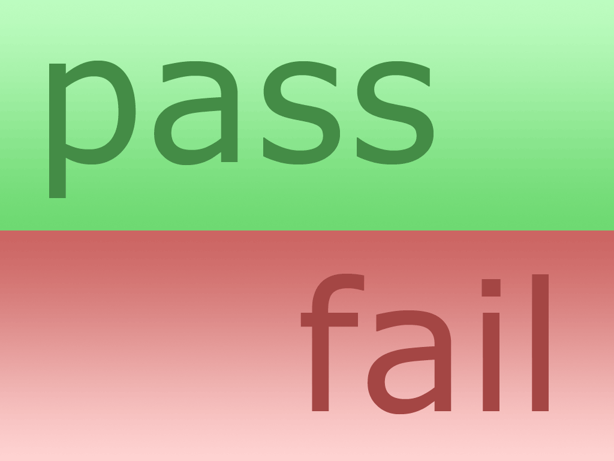

# Test - ruby



El objetivo del trabajo práctico es construir un framework de testeo en Ruby que incorpore la funcionalidad básica para poder aplicarlo en un contexto laboral, y que soporte extensiones de usabilidad basadas en convenciones e implementadas con metaprogramación.
En esta entrega tenemos objetivo desarrollar la lógica necesaria para implementar la funcionalidad que se describe a continuación. Además de cumplir con los objetivos descritos, es necesario hacer el mejor uso posible de las herramientas vistas en clase, sin descuidar el diseño.
Esto incluye:
- Evitar repetir lógica.
- Evitar generar construcciones innecesarias (mantenerlo lo más simple posible).
- Buscar un diseño robusto que pueda adaptarse a nuevos requerimientos.
- Mantener las interfaces lo más limpias posibles.
- Elegir adecuadamente dónde poner la lógica y qué abstracciones modelar.
- Aprovechar las abstracciones provistas por el metamodelo de Ruby.
- Realizar testeos integrales de la aplicación cuidando también el diseño de los mismos.

## Antes de empezar: algunos consejos

El enunciado tiene **mucha** información, van a necesitar leerlo varias veces. La sugerencia es que lo lean entero una vez (para tener una idea general) y luego vuelvan a consultarlo las veces que hagan falta.

Concéntrense en los **requerimientos** y, excepto que se traben mucho, respeten el orden sugerido. Sería interesante que vayan creando las distintas clases y métodos a medida que resuelven cada requerimiento y no antes.

## Requerimientos

Una parte fundamental de cualquier framework de testing es la posibilidad de describir qué tiene que ocurrir para que el test falle o tenga éxito. Con este fin, vamos a definir un pequeño DSL que soporte una sintaxis amigable para verificar las postcondiciones de nuestros tests.

### Etapa 1

Para comenzar, debemos poder determinar si un objeto es igual a un valor esperado. Para esto debemos hacer que todos los objetos comprendan el mensaje `deberia_ser(valor_esperado)`. Este mensaje tiene que recibir por parámetro el valor esperado para poder realizar la comparación.
Vale aclarar que si el valor_esperado es una clase, se debe chequear que el árbol de herencia del objeto a ser testeado contenga la clase pasada como parámetro.

```ruby
7.deberia_ser 7 # Pasa.
=> 7 es 7
true.deberia_ser false # Falla.
=> Se esperaba true y el valor fue false
bicicleta.ruedas.deberia_ser 4 # Falla: bicicleta tiene 2 ruedas.
=> Se esperaba 4 y el valor fue 2

7.deberia_ser Integer # Pasa.
=> 7 es un Integer
bicicleta.deberia_ser Object # Pasa.
=> #<Bicicleta:0x0156f2fw> es un Object
```

Al ejecutar el método `deberia_ser` se desea obtener información sobre el test que se corrió y su resultado para mostrar por pantalla. Si bien la consola muestra strings con los resultados; se recomienda modelar la ejecución y resultados con objetos de alto nivel, y no concatenando strings.

### Etapa 2

En esta primera etapa del framework, se requiere que a la clase a testear se le pueda agregar la capacidad de ser testeada.

Dicha capacidad se ve reflajada en la habilidad de sus instancias a responder a los mensajes `testear` y `tests`.

El método `tests` debe devolver una lista con los símbolos correspondientes a los métodos que contienen tests (para simplicidad del framework, colocar 1 test por método como última sentencia).

El método `testear` debe ejecutar todos los tests devueltos por el método definido anteriormente, y realizar un pequeño informe en donde muestre la cantidad de tests corridos, cantidad de tests pasados y cantidad de tests fallados. De estos últimos se debe informar de la manera más clara posible qué se esperaba y qué valor se obtuvo.

### Etapa 3

El próximo paso de nuestro framework es otorgarle la capacidad al framework a realizar una mayor cantidad de chequeos. Para realizar esta ampliación, queremos que todos los objetos comprendan el mensaje `deberia` que reciba una aserción, que es la especificación de lo que se quiere que se cumpla.

Se espera que las aserciones puedan escribirse de la siguiente manera.

```ruby
7.deberia ser 7
agustin.nombre.deberia ser "Agustin"
[1, 2, 3, 4].first.deberia ser 1
```

> **Nota**: La sintaxis de Ruby es bastante permisiva a la hora de permitir o no omitir paréntesis. La manera de conseguir que nuestro framework soporte la sintaxis que pedimos al principio puede parecer confuso, pero tengan en cuenta que las siguientes dos líneas son exactamente iguales (si consiguen se soporte la primera, la segunda va a funcionar solita):

```ruby
objeto.m1(self.m2(self.m3(parametro)))
objeto.m1 m2 m3 parametro # Ruby permite escribir lo de arriba así.
```

#### Ser

Queremos poder crear una aserción que verifique que un objeto sea el esperado, pasado por parámetro. Esta primera aserción es una reformulación del requerimiento de la etapa 1.

#### Entender

En lenguajes dinámicos, como Ruby, los programas pueden modificar las interfaces de los objetos en tiempo de ejecución. Es por eso que a veces resulta necesario testear si un objeto entiende o no cierto mensaje, como así también chequear la cantidad de parámetros con los que hay que invocarlo.

Una aclaración respecto a este punto es que por defecto el método `entender` no recibe parámetros. Solamente si recibe un número (mayor o igual a 0) es que se chequea que el método reciba la misma cantidad de parámetros que el número que se pasa como parámetro. 

```ruby
class Persona
  attr_accessor :nombre, :edad

  def adolescente?
    @edad > 18 && @edad < 40
  end
end

agustin.deberia entender :adolescente? # Pasa.
agustin.deberia entender :class  # Pasa: Este mensaje se hereda de Object.
agustin.deberia entender :apellido # Falla: agustin no entiende el mensaje.
agustin.deberia entender :nombre=, 1 # Pasa: agustin entiende el mensaje y recibe 1 parametro.
agustin.deberia entender :nombre=, 2 # Falla: agustin entiende el mensaje y pero recibe unicamente 1 parametro.
```

### Etapa 4

Otra cosa que buscamos es la facilidad el chequeo de propiedades booleanas (que en Ruby se escriben, por convención con un “?” al final del nombre). Para poder realizar estos tests, se debe poder crear aserciones enviando mensajes con el siguiente formato `ser_<<nombre_metodo>>`

```ruby
agustin.deberia ser_adolescente # Pasa.
1.deberia ser_zero # Falla.
```

### Etapa 5

Ya definidas distintas especificaciones para los tests, es momento de definir los tests de una forma que se pueda evitar todo el trabajo manual de determinar los métodos con tests.

Para definir los métodos con tests, vamos a decir que es cualquier método cuto nombre comience con las palabras "testear_que", y no espere ningún parámetro.

```ruby
# Esto es un test
def testear_que_las_personas_de_mas_33_son_adolescentes
  agustin = Persona.new(“Agustin”, 33)
  agustin.deberia ser_adolescente
end

# Esto no
def las_personas_de_mas_de_33_son_adolescentes
  agustin = Persona.new(“Agustin”, 33)
  agustin.deberia ser_adolescente
end
```

Por otro lado, tenemos los “Suites”, que suelen tener tests relacionados por algún criterio (normalmente, aquello que están testeando). En la práctica, vamos a representar a los Suites como Clases de Ruby

```ruby
# Esto es un Suite
class SuiteDeTests
  def testear_que_pasa_algo
  end
  def metodo_que_no_es_un_test
  end
end

# Esto no
class ClaseComun
  def metodo_que_no_es_un_test
  end
end
```

La estructura de Tests y Suites es importante porque queremos tener una forma estandarizada para poder correr los tests. Para esto debe ser posible correr todos los tests de una Clase, como así también correr tests en particular. Para esto el Framework debe contar con la siguiente forma de poder realizar lo pedido:

```ruby
# Correr todos los tests de la suite MiSuite
Tester.testear MiSuite
# Correr los tests :testear_que_una_cosa, :testear_que_otra_cosa y cualquier otro test de la suite MiSuite cuyo nombre se pase por parámetro
Tester.testear MiSuite, :una_cosa, :otra_cosa, etc...
```

Al correr los tests correspondientes al llamado de `testear`, se debe informar la cantidad de tests corridos, cantidad y nombre de tests pasados, y cantidad y nombres de tests fallados. De estos últimos se debe informar de la manera más clara posible qué se esperaba y qué valor se obtuvo.

## Créditos

Enunciado original creado para UTN - FRBA. Transformado a Markdown por Agustín Hodes para UNaHur. Reformateado, reorganizado el texto y agregados nuevos requerimientos por Federico Aloi y Agustín Hodes para UNaHur.
